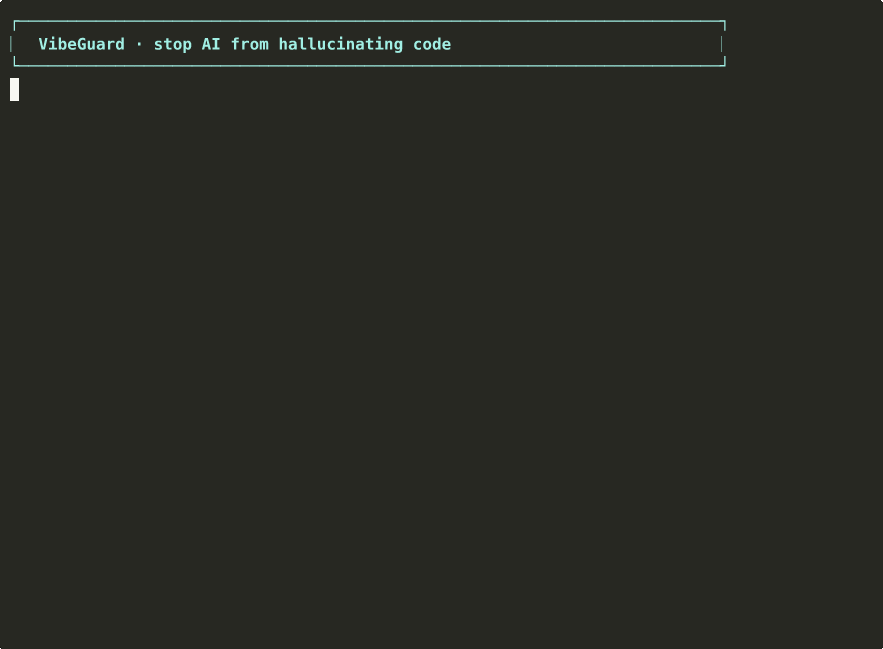

# VibeGuard

[](https://github.com/majiayu000/vibeguard/actions/workflows/ci.yml)

**Stop Claude Code and Codex from making the same expensive mistakes twice.**

[Chinese Docs](docs/README_CN.md) · [Rule Reference](docs/rule-reference.md) · [Contributing](CONTRIBUTING.md)

VibeGuard adds **native rules + real-time hooks + static guards** to catch what AI coding agents get wrong — **before it reaches your codebase**:

- Duplicate files and reinvented modules
- Invented APIs, fake libraries, and hardcoded placeholder values
- Dangerous shell/git commands (`rm -rf`, `push --force`, `reset --hard`)
- Analysis paralysis and unverified "I'm done" claims
- Silent exception swallowing and `Any`-type abuse
- AI-slop patterns flagged on every commit

Works with **Claude Code** and **Codex CLI**.

## Install in 30 seconds

```bash
git clone https://github.com/majiayu000/vibeguard.git ~/vibeguard
bash ~/vibeguard/setup.sh
```

Open a new Claude Code or Codex session. Run `bash ~/vibeguard/setup.sh --check` to verify.

## What you actually get

| Layer | What it does |
|-------|--------------|
| **Native Rules** | Bias the model away from bad decisions before it acts |
| **Hooks** | Block dangerous or low-quality actions in real time |
| **Static Guards** | Scan projects for AI-slop, duplicates, and structural issues |
| **Slash Commands** | `/vibeguard:*` workflows for preflight / review / check / learn |
| **Learning System** | Turn repeated AI mistakes into reusable defenses |
| **Observability** | Metrics and health for every interception |

## Product Boundaries

VibeGuard has two layers:

| Surface | Scope | Canonical Source |
|---------|-------|------------------|
| **VibeGuard Core** | Rules, hooks, static guards, install/runtime contract, observability | `rules/claude-rules/`, `schemas/install-modules.json`, `hooks/`, `guards/` |
| **VibeGuard Workflows** | Slash commands, agent prompts, planning/execution presets | `skills/`, `workflows/`, `agents/` |

If these surfaces disagree, treat the Core contract as authoritative first, then update workflow/docs surfaces to match it.

For repository layout ownership, see [Directory Map](docs/directory-map.md).

## What it looks like in practice



```text
You:  "Add a login endpoint"

AI:   → tries to create auth_service.py
      ✗ VibeGuard blocks — duplicate of existing auth.py, search first

      → tries to import `flask-auth-magic`
      ✗ VibeGuard blocks — non-existent library, verify before adding

      → hardcodes JWT secret as "your-secret-key"
      ✗ VibeGuard flags — use env var or secret manager

      → runs `git push --force`
      ✗ VibeGuard denies — suggests `--force-with-lease`

      → keeps reading files without acting
      ⚠ VibeGuard escalates — force a concrete next step or report blocker

      → claims done without verifying
      ⚠ VibeGuard gates — run build/test before finishing
```

**Every interception returns a fix instruction**, not just a failure — so the agent can self-correct.

Re-record your own demo: see [docs/assets/README.md](docs/assets/README.md) (one command via asciinema + agg).

## Who this is for

Use VibeGuard if you:

- Use Claude Code or Codex regularly
- Have seen duplicate files, fake APIs, over-engineering, or unverified "done" claims
- Want **mechanical enforcement**, not just prompt guidelines

It may be overkill if you only use AI occasionally or don't want hook-level interception.

Inspired by [OpenAI Harness Engineering](https://openai.com/index/harness-engineering/) and [Stripe Minions](https://www.youtube.com/watch?v=bZ0z1ApYjJo). Fully implements all 5 Harness Golden Principles.

## How It Works

### Rule Injection (active from session start)

The native rule set in `rules/claude-rules/` is installed to Claude Code's native rules system (`~/.claude/rules/vibeguard/`), directly influencing AI reasoning. Plus a 7-layer constraint index injected into `~/.claude/CLAUDE.md`:

| Layer | Constraint | Effect |
|-------|-----------|--------|
| L1 | Search before create | Must search for existing implementations before creating new files |
| L2 | Naming conventions | `snake_case` internally, `camelCase` at API boundaries, no aliases |
| L3 | Quality baseline | No silent exception swallowing, no `Any` types in public methods |
| L4 | Data integrity | No data = show blank, no hardcoding, no inventing APIs |
| L5 | Minimal changes | Only do what was asked, no unsolicited "improvements" |
| L6 | Process gates | Large changes require preflight, structured planning, and verification |
| L7 | Commit discipline | No AI markers, no force push, no secrets |

Rules use **negative constraints** ("X does not exist") to implicitly guide AI, which is often more effective than positive descriptions.

Canonical references for this contract:
- Install/runtime contract: `schemas/install-modules.json`
- Native rule source: `rules/claude-rules/`
- Public summary of current rule surface: `docs/rule-reference.md`

### Hooks — Real-Time Interception

Most hooks trigger automatically during AI operations. `skills-loader` remains an optional manual hook, and Codex currently deploys only Bash/Stop hook events:

| Scenario | Hook | Result |
|----------|------|--------|
| AI creates new `.py/.ts/.rs/.go/.js` file | `pre-write-guard` | **Block** — must search first |
| AI runs `git push --force`, `rm -rf`, `reset --hard` | `pre-bash-guard` | **Block** — suggests safe alternatives |
| AI edits non-existent file | `pre-edit-guard` | **Block** — must Read file first |
| AI adds `unwrap()`, hardcoded paths | `post-edit-guard` | **Warn** — with fix instructions |
| AI adds `console.log` / `print()` debug statements | `post-edit-guard` | **Warn** — use logger instead |
| AI creates duplicate definitions after a new file write | `post-write-guard` | **Warn** — detect duplicate symbols and same-name files |
| AI keeps reading/searching without acting | `analysis-paralysis-guard` | **Escalate** — force a concrete next step or blocker report |
| AI edits code in `full` / `strict` profile | `post-build-check` | **Warn** — run language-appropriate build check |
| `git commit` | `pre-commit-guard` | **Block** — quality + build checks (staged files only), 10s timeout |
| AI tries to finish with unverified changes | `stop-guard` | **Gate** — complete verification first |
| Session ends | `learn-evaluator` | **Evaluate** — collect metrics and detect correction signals |

### Static Guards — Run Anytime

Representative standalone checks you can run on any project. The complete inventory lives in [docs/rule-reference.md](docs/rule-reference.md).

```bash
# Universal
bash ~/vibeguard/guards/universal/check_code_slop.sh /path/to/project     # AI code slop
python3 ~/vibeguard/guards/universal/check_dependency_layers.py /path      # dependency direction
python3 ~/vibeguard/guards/universal/check_circular_deps.py /path          # circular deps
bash ~/vibeguard/guards/universal/check_test_integrity.sh /path            # test shadowing / integrity issues

# Rust
bash ~/vibeguard/guards/rust/check_unwrap_in_prod.sh /path                 # unwrap/expect in prod
bash ~/vibeguard/guards/rust/check_nested_locks.sh /path                   # deadlock risk
bash ~/vibeguard/guards/rust/check_declaration_execution_gap.sh /path      # declared but not wired
bash ~/vibeguard/guards/rust/check_duplicate_types.sh /path                # duplicate type definitions
bash ~/vibeguard/guards/rust/check_semantic_effect.sh /path                # semantic side effects
bash ~/vibeguard/guards/rust/check_single_source_of_truth.sh /path         # single source of truth
bash ~/vibeguard/guards/rust/check_taste_invariants.sh /path               # taste/style invariants
bash ~/vibeguard/guards/rust/check_workspace_consistency.sh /path          # workspace dep consistency

# Go
bash ~/vibeguard/guards/go/check_error_handling.sh /path                   # unchecked errors
bash ~/vibeguard/guards/go/check_goroutine_leak.sh /path                   # goroutine leaks
bash ~/vibeguard/guards/go/check_defer_in_loop.sh /path                    # defer in loop

# TypeScript
bash ~/vibeguard/guards/typescript/check_any_abuse.sh /path                # any type abuse
bash ~/vibeguard/guards/typescript/check_console_residual.sh /path         # console.log residue
bash ~/vibeguard/guards/typescript/check_component_duplication.sh /path    # duplicated component files
bash ~/vibeguard/guards/typescript/check_duplicate_constants.sh /path      # repeated constant definitions

# Python
python3 ~/vibeguard/guards/python/check_duplicates.py /path                # duplicate functions/classes/protocols
python3 ~/vibeguard/guards/python/check_naming_convention.py /path         # camelCase mix
python3 ~/vibeguard/guards/python/check_dead_shims.py /path                # dead re-export shims
```

## Slash Commands

10 custom commands covering the full development lifecycle. Shortcuts: `/vg:pf` `/vg:gc` `/vg:ck` `/vg:lrn`.

| Command | Purpose |
|---------|---------|
| `/vibeguard:preflight` | Generate constraint set before changes |
| `/vibeguard:check` | Full guard scan + compliance report |
| `/vibeguard:review` | Structured code review (security → logic → quality → perf) |
| `/vibeguard:cross-review` | Dual-model adversarial review (Claude + Codex) |
| `/vibeguard:build-fix` | Build error resolution |
| `/vibeguard:learn` | Generate guard rules from errors / extract Skills from discoveries |
| `/vibeguard:interview` | Deep requirements interview → SPEC.md |
| `/vibeguard:exec-plan` | Long-running task execution plan, cross-session resume |
| `/vibeguard:gc` | Garbage collection (log archival + worktree cleanup + code slop scan) |
| `/vibeguard:stats` | Hook trigger statistics |

**Complexity Routing**

| Scope | Flow |
|-------|------|
| 1-2 files | Just implement |
| 3-5 files | `/vibeguard:preflight` → constraints → implement |
| 6+ files | `/vibeguard:interview` → SPEC → `/vibeguard:preflight` → implement |

## Multi-Agent Dispatch

14 built-in agent prompts (13 specialists + 1 dispatcher) with automatic routing:

| Agent | Purpose |
|-------|---------|
| `dispatcher` | **Auto-route** — analyzes task type and routes to the best agent |
| `planner` / `architect` | Requirements analysis and system design |
| `tdd-guide` | RED → GREEN → IMPROVE test-driven development |
| `code-reviewer` / `security-reviewer` | Layered code review and OWASP Top 10 |
| `build-error-resolver` | Build error diagnosis and fix |
| `go-reviewer` / `python-reviewer` / `database-reviewer` | Language-specific review |
| `refactor-cleaner` / `doc-updater` / `e2e-runner` | Refactoring, docs, and E2E tests |

## Observability

```bash
bash ~/vibeguard/scripts/quality-grader.sh              # Quality grade (A/B/C/D)
bash ~/vibeguard/scripts/stats.sh                       # Hook trigger stats (7 days)
bash ~/vibeguard/scripts/hook-health.sh 24              # Hook health snapshot
bash ~/vibeguard/scripts/metrics/metrics-exporter.sh    # Prometheus metrics export
bash ~/vibeguard/scripts/verify/doc-freshness-check.sh  # Rule-guard coverage check
```

## Learning System

Closed-loop learning evolves defenses from mistakes:

**Mode A — Defensive**

```text
/vibeguard:learn <error description>
```

Analyzes root cause (5-Why) → generates a new guard/hook/rule → verifies detection → the same class of error should not recur.

**Mode B — Accumulative**

```text
/vibeguard:learn extract
```

Extracts non-obvious solutions as structured Skill files for future reuse.

## Installation

### Profiles and languages

```bash
# Profiles
bash ~/vibeguard/setup.sh                              # Install (default: core profile)
bash ~/vibeguard/setup.sh --profile minimal           # Minimal: pre-hooks only (lightweight)
bash ~/vibeguard/setup.sh --profile full              # Full: adds Stop Gate + Build Check + Pre-Commit
bash ~/vibeguard/setup.sh --profile strict            # Strict: same hook set as full, for stricter runtime policy

# Language selection (only install rules/guards for specified languages)
bash ~/vibeguard/setup.sh --languages rust,python
bash ~/vibeguard/setup.sh --profile full --languages rust,typescript

# Verify / Uninstall
bash ~/vibeguard/setup.sh --check                     # Verify installation
bash ~/vibeguard/setup.sh --clean                     # Uninstall
```

| Profile | Hooks Installed | Use Case |
|---------|----------------|----------|
| `minimal` | pre-write, pre-edit, pre-bash | Lightweight — only critical interception |
| `core` (default) | minimal + post-edit, post-write, analysis-paralysis | Standard development |
| `full` | core + stop-guard, learn-evaluator, post-build-check | Full defense + learning |
| `strict` | same hook set as full | Maximum enforcement |

### Codex Integration

VibeGuard deploys hooks and skills to both Claude Code and Codex CLI.

Hooks live in `~/.codex/hooks.json` (requires `codex_hooks = true` in `config.toml`):

| Event | Hook | Function |
|-------|------|----------|
| `PreToolUse(Bash)` | `pre-bash-guard.sh` | Dangerous command interception + package manager correction |
| `PostToolUse(Bash)` | `post-build-check.sh` | Build failure detection |
| `Stop` | `stop-guard.sh` | Uncommitted changes gate |
| `Stop` | `learn-evaluator.sh` | Session metrics collection |

> **Note:** Codex PreToolUse/PostToolUse currently only supports the `Bash` matcher. Edit/Write guards (`pre-edit`, `pre-write`, `post-edit`, `post-write`) and `analysis-paralysis` are not deployable on the native Codex CLI hook path.

Codex hook command names are namespaced as `vibeguard-*.sh` to avoid collisions with other toolchains sharing `~/.codex/hooks.json`. Output format differences are handled by the `run-hook-codex.sh` wrapper (Claude Code `decision:block` → Codex `permissionDecision:deny`). When a hook suggests `updatedInput`, the Codex CLI wrapper cannot apply it automatically, so VibeGuard emits an explicit note with the suggested replacement command instead of silently dropping it.

**App-server wrapper** (Symphony-style orchestrators):

```bash
python3 ~/vibeguard/scripts/codex/app_server_wrapper.py --codex-command "codex app-server"
```

- `--strategy vibeguard` (default): applies pre/stop/post gates externally
- `--strategy noop`: pure pass-through for debugging
- App-server wrapper scope today: Bash approval interception + post-turn stop/build feedback with explicit `thread/session/turn` propagation
- Still unsupported on app-server path: `pre-edit`, `pre-write`, `post-edit`, `post-write`, `analysis-paralysis`

### Use with any project

| Tool | How |
|------|-----|
| **OpenAI Codex** | `cp ~/vibeguard/templates/AGENTS.md ./AGENTS.md` + `bash ~/vibeguard/setup.sh` (installs skills + Codex hooks) |
| **Any project (rules only)** | `cp ~/vibeguard/docs/CLAUDE.md.example ./CLAUDE.md` |

### Project Bootstrap

Bootstrap another repository with project-specific guidance and the pre-commit wrapper:

```bash
bash ~/vibeguard/scripts/project-init.sh /path/to/project
```

### Local Contract Gate (contributors)

Run stable contract checks locally before pushing, or wire them as a pre-commit hook:

```bash
bash scripts/local-contract-check.sh          # run the full local gate
bash scripts/install-pre-commit-hook.sh       # install as git pre-commit hook
```

See [CONTRIBUTING.md](CONTRIBUTING.md) for the local-vs-CI split and the `--quick` flag.

### Custom Rules

Add your own rules to `~/.vibeguard/user-rules/`. Any `.md` files placed there are automatically installed to `~/.claude/rules/vibeguard/custom/` on the next setup run. Format: standard Claude Code rule files with YAML frontmatter.

## Design Principles

| Principle | From | Implementation |
|-----------|------|----------------|
| Automation over documentation | Harness #3 | Hooks + guard scripts enforce mechanically |
| Error messages = fix instructions | Harness #3 | Every interception tells AI how to fix, not just what's wrong |
| Maps not manuals | Harness #5 | 7-layer index + negative constraints + lazy loading |
| Failure → capability | Harness #2 | Mistake → learn → new guard → never again |
| If agent can't see it, it doesn't exist | Harness #1 | All decisions written to repo (`CLAUDE.md` / ExecPlan / logs) |
| Give agent eyes | Harness #4 | Observability stack (logs + metrics + alerts) |

## Known Issues

Guard scripts rely heavily on pattern matching (grep/awk or lightweight AST helpers), which means false positives can still happen in some scenarios.

- [Known False Positives](docs/known-issues/false-positives.md) — identified false positive scenarios, fixes, and lessons learned

Key lessons:

- **grep is not an AST parser** — nested scopes and multi-block structures need language-aware tools
- **Guard fix messages are consumed by AI agents** — an imprecise fix hint can itself trigger unnecessary edits
- **Project type awareness matters** — CLI/Web/MCP/Library codebases may need different acceptable patterns for the same language rule

## Documentation

| Doc | Purpose |
|-----|---------|
| [docs/README_CN.md](docs/README_CN.md) | Chinese overview and setup guide |
| [docs/rule-reference.md](docs/rule-reference.md) | Rule layers, guard coverage, and language-specific checks |
| [docs/CLAUDE.md.example](docs/CLAUDE.md.example) | Project-level CLAUDE template without installing hooks |
| [docs/linux-setup.md](docs/linux-setup.md) | Linux-specific setup notes |
| [docs/known-issues/false-positives.md](docs/known-issues/false-positives.md) | Known guard false positives and mitigation notes |
| [docs/assets/README.md](docs/assets/README.md) | Demo recording script and assets |
| [CONTRIBUTING.md](CONTRIBUTING.md) | Contributor workflow, validation commands, and commit protocol |

## References

- [OpenAI Harness Engineering](https://openai.com/index/harness-engineering/)
- [Stripe Minions](https://www.youtube.com/watch?v=bZ0z1ApYjJo)
- [Anthropic: Effective Harnesses for Long-Running Agents](https://www.anthropic.com/engineering/effective-harnesses-for-long-running-agents)

---

[Chinese Documentation →](docs/README_CN.md)
