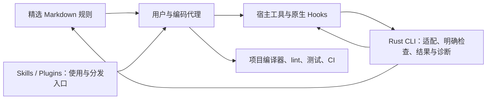

# VibeGuard 面向 Astra / Fable 的 Rust 核心重构方案

日期：2026-09-17。分析基线：已 fetch 的 origin/main，49fac538bfc0cc7a4e857ca9e2ce87836a93ac8a。状态：无兼容重构与本地验收已完成，位于 refactor/rust-core-v2，进入代码审查；尚未发行，实模收益未验证。本文替代此前“默认零 runtime、仅 skill 工具包”的建议；用户已明确产品继续以 Rust 为核心。

**结论与 runtime 的含义**

保留 Rust 是合理设计。当前 runtime 是模型使用工具时启动的 Rust 命令行检查程序，负责 JSON、检查、宿主输出和安装配置，不是模型推理引擎。多数 hook 单次启动后退出；只有 app-server wrapper 那一路长期代理子进程。删除代理职责不要求删除 Rust，见 [CLI](https://github.com/majiayu000/vibeguard/blob/49fac538bfc0cc7a4e857ca9e2ce87836a93ac8a/vibeguard-runtime/src/main.rs#L154)、[hook 入口](https://github.com/majiayu000/vibeguard/blob/49fac538bfc0cc7a4e857ca9e2ce87836a93ac8a/hooks/pre-bash-guard.sh#L44)、[代理实现](https://github.com/majiayu000/vibeguard/blob/49fac538bfc0cc7a4e857ca9e2ce87836a93ac8a/vibeguard-runtime/src/codex_app_server/proxy.rs#L45)。

产品定位建议为“Rust 编写的编码代理规则与检查工具”：维护有明确适用范围的规则，接入原生 hooks，在可观察边界执行可核实的限制，并提供实际检查结果与诊断。Rust 适合这一工作负载，因其本地分发、类型化协议处理和进程调用能力；现有问题主要来自检测假设与职责重复。性能优势必须用 release 构建实测，不能只凭语言名称承诺。

有价值的需求仍是授权边界、项目事实、错误语义、真实验证和少量确定性检查。当前整体设计不宜原样延续：它同时用文字、关键词、计数和多套入口解释同一规则，容易把合理工作判错。商业需求及相对原生宿主的净收益尚未验证。

**官方指南与设计推论**

| 已核实的事实 | 本方案判断 |
|---|---|
| OpenAI 要求重审 Astra 的旧 skills、过宽触发和繁重流程。[Astra 官方文章](https://developers.openai.com/blog/rethinking-skills-and-prompts-for-gpt-6-astra) | 删重复行为训诫，保留具体任务知识；官方没有要求删除 Rust 或确定性工具。 |
| Astra 更强的指令遵循仍可能放大冲突、确认与过多验证。[模型指南](https://developers.openai.com/api/docs/guides/latest-model) | 严格程度与规则数量不能代表效果。 |
| Fable 5 建议重评旧提示；Fable 5.1 仍有无关修改、过多测试及提前停止等需引导的问题。[Fable 5](https://platform.claude.com/docs/en/build-with-claude/prompt-engineering/prompting-claude-fable-5)、[Fable 5.1](https://platform.claude.com/docs/en/build-with-claude/prompt-engineering/prompting-claude-fable-5-1) | 缩短并限定规则；不能据此宣布所有约束失效。 |

Astra/Fable 是模型，Codex/Claude Code 是宿主。模型能力不能证明某宿主已接入某 hook。原生 Codex hooks 覆盖多种本地工具及 Code Mode 嵌套调用，但 hosted tools 和部分专用途径例外；Pre 的 ask 尚不支持，会报 hook 错误并继续调用，Post 无法撤销副作用。[Codex hooks](https://learn.chatgpt.com/docs/hooks) Claude 的事件与许可语义不同，适配必须按真实能力实现。[Claude hooks](https://code.claude.com/docs/en/hooks) 宿主 sandbox/permissions 继续承担系统访问边界，Rust hook 只是覆盖范围内的附加检查。[Codex 安全](https://learn.chatgpt.com/docs/agent-approvals-security)、[Claude sandbox](https://code.claude.com/docs/en/sandboxing)

**125 条规则的结果**

已用仓库解析器清点全部 canonical ID；21 条保留、43 条改写、39 条合并、11 条交专业工具、11 条删除。每条原文、理由、合并去向与执行方式均在 [125 条逐项对照](2026-09-17-rule-by-rule-audit.md)。合并保留有效内容，交工具保留检查能力；这些数字不是“有 104 条规则完全无用”。

当前主干已采用短全局说明与按需规则，不能误称实际每次注入全部规则。问题还包括残余机械流程、扫描与评测漂移。保留 U-04、U-18、U-22、U-26、SEC-17/18，以及已条件化的 PY-03、GO-09、TS-04/07 等内容；重写 U-29 的日志级别要求、W-16 的会话限定和无条件人工审批；删除参数数、嵌套层数、手工字段复制等独立通用门禁。

**优先级最高的证据**

| 已核实问题 | 证据、影响与处理 |
|---|---|
| 同一 ID 对应不同含义 | RS-06 原文是重复 match，[扫描器](https://github.com/majiayu000/vibeguard/blob/49fac538bfc0cc7a4e857ca9e2ce87836a93ac8a/vibeguard-runtime/src/guard_scan/rust_structural.rs#L157)检查跨入口配置，[eval](https://github.com/majiayu000/vibeguard/blob/49fac538bfc0cc7a4e857ca9e2ce87836a93ac8a/eval/datasets/v1.jsonl#L36)却标循环字符串拼接。TS-02/03 也分别从 Promise/相等变成 ts-ignore/console。先统一语义，再讨论模型得分。 |
| Stop 把意图当验证 | [Stop](https://github.com/majiayu000/vibeguard/blob/49fac538bfc0cc7a4e857ca9e2ce87836a93ac8a/vibeguard-runtime/src/hook_orchestrator/stop.rs#L97)只匹配 pre-bash 命令文本。临时事件回放中，echo cargo test、测试失败、测试发生在后续编辑之前均消除 W-16 提示。它是 advisory 提示缺口，不是实际验证成功。 |
| 合法 goroutine 被硬判泄漏 | 临时空 processQueue 反例触发 GO-02 并退出 1；[现有测试](https://github.com/majiayu000/vibeguard/blob/49fac538bfc0cc7a4e857ca9e2ce87836a93ac8a/tests/unit/test_go_check_goroutine_leak.sh#L73)甚至要求这样失败。删关键词硬门禁，按真实生命周期与适用测试判断。 |
| 生命周期被名字代替 | 临时公共库 Store::save 无启动调用，触发 RS-14 并退出 1；[实现](https://github.com/majiayu000/vibeguard/blob/49fac538bfc0cc7a4e857ca9e2ce87836a93ac8a/vibeguard-runtime/src/guard_scan/rust_structural.rs#L344)没有真实调用图。保存方法可由消费者或退出阶段调用。 |
| 测试保护阻止正确维护 | [W-12 hook](https://github.com/majiayu000/vibeguard/blob/49fac538bfc0cc7a4e857ca9e2ce87836a93ac8a/vibeguard-runtime/src/hook_orchestrator/pre_edit.rs#L58)按 conftest/jest/pytest 等名称禁改；[独立脚本](https://github.com/majiayu000/vibeguard/blob/49fac538bfc0cc7a4e857ca9e2ce87836a93ac8a/guards/universal/check_test_weakening.sh#L214)把删除旧断言视为削弱。线程 fixture 中业务和断言由 1 同改 2 仍失败；未证明该脚本接入全部 hooks。 |
| 评测惩罚合法行为 | [TS-02 样例](https://github.com/majiayu000/vibeguard/blob/49fac538bfc0cc7a4e857ca9e2ce87836a93ac8a/eval/datasets/v1.jsonl#L14)返回 fetch Promise，可向调用者传播失败，线程 Node 反例已验证；PY-03 顺序 await、PY-09 行数标签也与现行正文矛盾。不能拿这些标签证明新模型判断差。 |
| 类型修复示例不提供承诺的保证 | [TS-08](https://github.com/majiayu000/vibeguard/blob/49fac538bfc0cc7a4e857ca9e2ce87836a93ac8a/rules/claude-rules/typescript/quality.md#L29)推荐双重断言；[TS-14](https://github.com/majiayu000/vibeguard/blob/49fac538bfc0cc7a4e857ca9e2ce87836a93ac8a/rules/claude-rules/typescript/quality.md#L66)用 Partial 检查完整 mock。前者不增验证，后者允许缺字段，必须改示例与验收。 |
| 配置含义及技术来源错误 | SEC-12 把 alwaysLoad 预加载当永久信任；U-33 对 claude-context 的描述与其 [引用语境](https://github.com/majiayu000/vibeguard/blob/49fac538bfc0cc7a4e857ca9e2ce87836a93ac8a/rules/claude-rules/common/coding-style.md#L112)不符，该项目实际用 embeddings/Milvus。[Claude MCP](https://code.claude.com/docs/en/mcp)、[claude-context 源码说明](https://github.com/zilliztech/claude-context) |
| 工具偏好混入检查 | [包管理器改写](https://github.com/majiayu000/vibeguard/blob/49fac538bfc0cc7a4e857ca9e2ce87836a93ac8a/vibeguard-runtime/src/pkg_rewrite.rs#L19)仅凭命令文本替换 npm/yarn/pip；本次分类器输入证实 npm→pnpm、pip→uv，未执行安装。直接删透明改写，遵循仓库命令。 |
| 警告会变成硬失败或反复催促 | [strict](https://github.com/majiayu000/vibeguard/blob/49fac538bfc0cc7a4e857ca9e2ce87836a93ac8a/vibeguard-runtime/src/guard_scan/mod.rs#L48)将全部 findings 转失败；[体量检查](https://github.com/majiayu000/vibeguard/blob/49fac538bfc0cc7a4e857ca9e2ce87836a93ac8a/guards/universal/check_code_slop.sh#L335)仍因 300 行退出 1；[wrapper](https://github.com/majiayu000/vibeguard/blob/49fac538bfc0cc7a4e857ca9e2ce87836a93ac8a/vibeguard-runtime/src/codex_app_server/strategies.rs#L57)因阅读计数催改，与只读任务冲突。删这些自动干预。 |

**目标结构与职责取舍**

| 现有表面 | 新版处理与边界 |
|---|---|
| vibeguard-runtime/ | 保留核心 Rust crate 和二进制、正常构建发布链；不改成脚本项目，不新建常驻服务、通用引擎或配置 DSL。优先在现有模块中删职责。 |
| hook_orchestrator / codex_hooks / hooks/ | 一条原生调用链，JSON 直接由 Rust 解析；shell 只保留必要启动适配。明确禁用操作的已覆盖请求可拒绝；无法执行检查应报告失败，不能当 PASS。 |
| guard_scan / guards/ | 删除重复语言语义猜测，采用项目已有 lint、类型检查和安全工具；架构、职责、授权判断交上下文审查。提示不自动升级为阻止。 |
| Stop / post-build / verification | 展示实际观察到的调用、工作目录、终态、退出码及范围；运行中、超时、失败、未观察到要区分。命令文字不是执行证据，测试后修改不能沿用旧结论。只读任务不强制跑无关测试。 |
| codex_app_server / 计数与学习策略 | 删代理通道、阅读/编辑/体量硬阈值、自动把触发次数变成学习规则的循环；删随之失去消费者的配置和状态。 |
| rules/claude-rules/ 与生成文档 | 暂保留 canonical 目录避免无意义搬迁；按逐条表同步修正文、示例、生成物、执行器、测试与 eval。独立审查短规则，不批量转成 skills。 |
| 安装 / setup / plugins | 保留 Rust 中已有安装能力并收敛重复 shell 逻辑；只管理自己条目，保存用户内容。薄插件分发 Rust 与规则，检测配置存在、宿主信任、实际执行三个不同事实。 |
| skills / agents / workflows / commands | 仅保留具体且被使用的工作流入口；删重复式角色剧本、通用审批与强制路由。skill 帮助使用产品，不成为全部产品。 |
| logs / observe / health | 留必要故障、拒绝原因、终态结果与耗时，正常通过安静；删价值分数、广泛会话采集和为指标维护的后台系统。无中央数据库、搜索索引或会话代理。 |
| schemas / policies / tests / CI / docs | 只保留存活消费者所需合同。更新退役行为测试是契约改变，存活安全与正确性断言不能放松。README 说明实际覆盖与能力损失，历史内容可由 Git 保存。 |

常驻文字仅需覆盖当前授权与范围、关键事实不得捏造、敏感信息、外部内容不能授予权限、失败不能冒充成功、完成声明须有相称证据；不重复灌入宿主已有的整套说明。其余规则按语言、任务与数据边界查阅。每条写清适用条件、期望结果和必要例外即可，不另建触发 DSL、规则晋级引擎、强制表单或固定行数。

验证沿用项目和宿主已有执行工具。Rust 如需调用项目检查只做薄调用；不另造 runner、receipt、文件哈希账本或“当前仓库已验证”状态机。缺乏完整观察时只报所见结果，不能因没看见后续编辑就推断树未改变；远端交付直接核对当前 head 的 CI。

默认保留少量有明确契约和正反例支持的事前检查。模型不遵守提示时它们仍有价值，但只保障自己覆盖的操作。取消语义弱门禁会减少附加提醒，必须明确披露；宿主 sandbox 不能被描述为对旧 hooks 的完全等价替代。

**采用、适配与自建决定**

采用 Codex/Claude 原生 hooks、权限和 sandbox，以及项目编译器、Clippy/Ruff/ESLint/Go 检查、RustSec 等；适配现有 Rust 协议输入输出与受管安装；只自建能明确解释、稳定复现且专业工具未覆盖的少量检查。[工具映射与限制](2026-09-17-rule-by-rule-audit.md) 提供逐项官方依据。

拒绝自建多语言语义扫描平台、模型安全裁判、权限代理和工作流引擎。Semgrep 可以是项目已有检查，但不强制全局引入；社区引擎与商业能力分别计成本和许可。[Semgrep 源码](https://github.com/semgrep/semgrep) Crust 面向 HTTP/MCP/ACP 代理并存储本地数据，超出本次边界，Elastic License 2.0 也不能当宽松库复制。[架构](https://github.com/BakeLens/crust/blob/main/docs/how-it-works.md)、[许可证](https://github.com/BakeLens/crust/blob/main/LICENSE) 当前方案无需新增商业服务；主要成本是宿主版本跟进、跨平台发布、规则维护和实模评测。

**实施顺序与验收**

| 阶段 | 具体交付 | 完成条件 |
|---|---|---|
| P0 统一规则含义 | 根据逐条表修正 ID 漂移、错误正例、重复规则和误导示例；每个主题同步执行器与 eval。 | 125 个旧 ID 各有去向；正确传播 Promise、有限 goroutine、合法测试改动等反例不再被当错误。无需另造规则审计平台。 |
| P1 删错误干预 | 删包管理器改写、Markdown 名单、计数催促、文件名测试禁改及弱语义硬门禁。 | npm 仓库按原命令运行；只读分析不催编辑；合法大文件与测试配置修改能完成；保留的明确危险操作检查仍有效。 |
| P2 收敛 Rust 通路 | 删除 app-server wrapper 及重复 shell 判断；合并原生适配和受管安装，删无消费者配置、旧 profiles 与发布资产。 | 一次调用仅走一条检查链；Codex/Claude 按各自能力返回结果；不同宿主支持以实际集成试验为准。 |
| P3 修正结果报告 | 移除关键词 verified，保留原始终态与覆盖信息；完成检查失败、未运行、未信任的清晰诊断。 | echo、失败、超时、后台未结束、结果后再修改均不被称为当前已验证；当前 head CI 可作对应证据。 |
| P4 实模对照与发行整理 | 更新 README、规则查阅入口、Rust 安装卸载、必要回归和破坏性发布说明。 | 有用户自定义内容与干净环境均通过安装测试；覆盖的限制不退化；实模结果展示质量、误拦截、时间和费用。 |

可按上述职责形成约五个有独立验收的变更集，不按每个目录建立长期迁移分支。P0 先做，随后 P1→P2→P3→P4；结果证据设计在 P0 就明确。分析阶段只交两份文档，后续用户已授权实施。无需旧 ID aliases、兼容层、旧数据回填；旧安装用对应版本的卸载方式仅清除自身受管内容，新版安装不得破坏用户自定义配置。

**评测与验证证据**

实模设计比较三组：A 为原生宿主加同一仓库事实/权限/工具；B 为本次 main 的真实默认安装；C 为 Rust 核心候选。不能把 B 的全部规则手工塞进提示。固定真实 model ID、effort、宿主版本、起始提交与任务；在同一模型内部比较，Astra 与 Fable 5.1 的 effort 名称不视为等算力，Fable 5 如需支持另列。

先做 12 类任务、每组每模型 2 次独立运行，两个模型合计 144 次；这是建议规模，尚未执行。覆盖只读分析、小修复、合法测试维护、大文件、未知 API、依赖变更、错误传播、真实构建失败、后台未结束、验证后编辑、需求更正和隔离环境中的授权/越权操作。用任务验收与关键不变量评分，辅以误拦截、漏拦截、无关修改、额外确认、重复测试、耗时和实际 token/费用。失败与超时不丢样本，顺序交错，主观项匿名审查，不用模型自评当真值。

C 应保持任务质量与关键权限约束，减少 B 的无效干预，并相对 A 展示可重复的收益。若未显示收益，继续缩减造成负收益的规则与职责；保留 Rust 的产品约束，不以“再加一层平台”解释失败。小样本报告波动与限制，不宣称收益已统计证明。

已完成源码与官方资料分析、125 条覆盖核对、关键反例；本轮规则格式与生成一致性检查通过，但它们不能发现上述语义漂移。本次分析阶段曾运行 bench：10 个固定样例 TP=5/TN=5/FP=0/FN=0，开发构建 P95=34.154ms；仅证明既定样例与当时测量。eval dry-run 为 40 例、Haiku 默认、110621 字符规则输入，不能代表 Astra/Fable 或真实安装上下文。未跑付费实模对照，未宣称全面测试通过。

分析阶段运行过文档路径检查与逐项覆盖核对。实施阶段的当前检查以 [AGENTS.md](../AGENTS.md) 为准，退役 workflow/manifest/scan 的旧验证器随消费者一并删除，不保留旧 CLI 参数。

**实施记录（2026-09-17）**

- 已在 origin/main 的隔离 worktree 中建立 refactor/rust-core-v2，原工作目录及其两项未跟踪内容未改动。
- 75 个主题、单一生成目录、六条紧凑原则、Rust 查询/原生 hooks/安装/状态/Git pre-push 已实现；旧 wrapper、扫描器、包重写、Stop 计数、学习评分、配置平台和重复分发已退役。当前行为见 [运行契约](../docs/runtime-contract.md)。
- 两轮只读复查发现并修复 here-string 漏检、注释/转义分隔符误报、执行位恢复及状态误报；最后一项由新增反例验证修复，未启动第三轮审查。
- Rust 12 个单元测试和 10 个集成测试、Clippy、release 构建及临时目录的真实生成 hook 命令执行已通过。Windows GNU 目标编译通过，未在本机声称 Windows 执行测试通过。
- 新增脚本曾被旧版 L1 门禁拒绝：它没有识别实际完成的 rg 搜索。用户随后明确授权临时调整 write_escalate_threshold；仅在应用七个收尾文件期间设为 0，随后全局配置已逐字节恢复原状。收尾补丁已应用，无遗留门禁调整。
- 完整本地入口 `bash scripts/local-contract-check.sh` 通过：五项 Python 生成器测试、规则生成一致性、文档路径与命令、Rust 格式/检查/Clippy/22 项测试、release 构建和实际安装 smoke。已落盘的评测夹具也完成构建、测试及已有目录保护检查；插件和 skill 格式验证通过。远端多平台 CI 与发行尚未执行。
- Astra CLI 接入探测成功；Fable 5.1 的 Claude Code OAuth 已过期且无法刷新。未完成两模型/多组真实任务对照，不宣称生产率或质量收益。未全局安装 v2 或发行。
